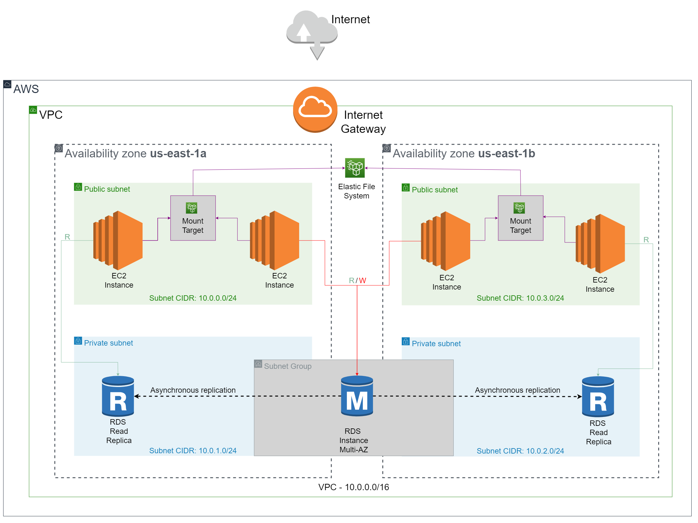

## Documentações das ferramentas de desenvolvimento utilizadas:

* [Terraform](https://www.terraform.io/docs/index.html)
* [AWS](https://docs.aws.amazon.com/index.html)
* [VScode](https://code.visualstudio.com/docs)

## Pré-requisitos

Para executar essa arquitetura, verifique se os seguintes requisitos foram cumpridos:

  * Terraform v1.4.6 ou mais recente instalado localmente (https://www.terraform.io/)
  * AWS CLI instalado (https://docs.aws.amazon.com/cli/latest/userguide/getting-started-install.html#getting-started-install-instructions)

## Material

  * Usuário IAM na conta do grupo H - devido ao uso de uma AMI personalizada
  * Chaves de acesso criadas para o usuário AWS CLI
  * Mantenha abertas abas das instâncias EC2 e RDS

    - https://console.aws.amazon.com/rds/

      - Selecione: Banco de Dados

    - https://console.aws.amazon.com/ec2/
        
      - Selecione: Instâncias
  * Este repositório git

## Estrutura do Projeto

  * Clone o projeto do github, no qual se encontram os seguintes arquivos:
```sh
projeto_cloud/
├── rds.tf 
├── ec2.tf 
├── sg.tf
├── subnet.tf
├── key.tf
├── efs.tf
├── provisioner.tf
├── credentials.tf
├── .gitignore
└── readme.md
```

### <span style="color:red">Atenção!</span> 
### A maior parte dos códigos a seguir são representativos!
### Não saia copiando!

- rds.tf
  * Determina a AWS como provider, assim como a região do deploy
  * Cria a database principal (Instância RDS Main Multi-AZ) e as suas réplicas de leitura
```sh
provider "aws" {
    region = "us-east-1" # Região da arquitetura
}

# Instância RDS Principal
resource "aws_db_instance" "mainDB" {
  depends_on = [aws_security_group.acesso-ssh-DatabaseA, aws_security_group.acesso-ssh-DatabaseB, aws_db_subnet_group.subnet-database-group]
  identifier               = "db-01"          # Nome de identificação do RDS
  engine                   = "mysql"          # Engine usada
  engine_version           = "8.0.32"         # Versão da engine
  instance_class           = "db.t2.micro"    # Classe da instância
  username                 = var.username     # Usuário da conexão RDS
  password                 = var.password     # Senha da conexão RDS
  multi_az                 = true             # Define se RDS tem cópia reserva em outra Zona de Disponibilidade
  allocated_storage        = 20               # Quantidade de armazenamento alocado
  backup_retention_period  = 1                # Período de retenção do backup automático do RDS (dias)
  skip_final_snapshot      = true             # Indica se deve pular a criação de um snapshot do RDS para restauração do mesmo

  vpc_security_group_ids   = [aws_security_group.acesso-ssh-DatabaseA.id, aws_security_group.acesso-ssh-DatabaseB.id]      # Grupo de Segurança
  db_subnet_group_name     = aws_db_subnet_group.subnet-database-group.name   # Grupo de subredes
}

# Exemplo de criação de RDS Read Replica
resource "aws_db_instance" "exemplo" {
  depends_on = [aws_db_instance.mainDB, aws_security_group.acesso-ssh-Database-exemplo]
  identifier               = "exemplo"     # Nome de identificação do RDS
  engine                   = "mysql"          # Engine usada
  engine_version           = "8.0.32"         # Versão da engine
  instance_class           = "db.t2.micro"    # Classe da instância
  replicate_source_db      = aws_db_instance.mainDB.identifier    # Recurso RDS usado como fonte de replicação
  skip_final_snapshot      = true             # Indica se deve pular a criação de um snapshot do RDS para restauração do mesmo

  availability_zone        = "us-east-1x"     # Zona de disponibilidade da instância
  vpc_security_group_ids   = [aws_security_group.acesso-ssh-Database-exemplo.id]      # Grupo de Segurança
}
```

- ec2.tf
  * Cria 4 instâncias EC2:
    * Uma instância para cada réplica de leitura (RDS)
    * Uma instância em cada Zona de Disponibilidade para a database principal (RDS)
```sh
# Exemplo de criação de EC2
resource "aws_instance" "EC2-exemplo" {
  depends_on = [aws_key_pair.chave-exemplo, aws_security_group.acesso-ssh-Regiaox, aws_subnet.public_subnet_us_east_1x]
  ami             = "ami-059c9094eadbcd5ca"               # Imagem ubuntu personalizada
  instance_type   = "t2.micro"                            # Tipo de instância EC2
  key_name        = aws_key_pair.chave-exemplo.key_name    # Key Pair utilizado
  tags            = {
      Name        = "EC2_exemplo"
  }

  availability_zone        = "us-east-1a"                 # Zona de disponibilidade da instância
  vpc_security_group_ids = ["${aws_security_group.acesso-ssh-Regiaox.id}"]    # Grupo de Segurança
  subnet_id              = aws_subnet.public_subnet_us_east_1x.id             # Id da Subrede
}
```

- sg.tf
  * Cria 8 Grupos de segurança:
    * Um para cada uma das 4 instâncias EC2
    * Um para cada uma das duas réplica de leitura (RDS)
    * Dois para a database principal (cada um conecta a uma instância EC2)
```sh
# Exemplo de criação de Security Group (EC2)
resource "aws_security_group" "acesso-ssh-Regiaox" {
  depends_on = [aws_vpc.vpc_database]
  name        = "acesso-sshx"
  description = "Allow SSH inbound traffic"
  vpc_id = aws_vpc.vpc_database.id

  ingress {
    # SSH
    from_port   = 22
    to_port     = 22
    protocol    = "tcp"
    cidr_blocks = ["0.0.0.0/0"] 
  }

  ingress {
    #EFS
    from_port   = 2049
    to_port     = 2049
    protocol    = "tcp"
    cidr_blocks = ["0.0.0.0/0"]
  }

  ingress {
    # Conexão com django app
    from_port   = 8000
    to_port     = 8000
    protocol    = "tcp"
    cidr_blocks = ["0.0.0.0/0"]
  }
  
  egress {
    from_port       = 0
    to_port         = 0
    protocol        = "-1"
    cidr_blocks     = ["0.0.0.0/0"]
  }
  tags = {
    Name = "sshx"
  }
}

# Exemplo de criação de Security Group (RDS)
resource "aws_security_group" "acesso-ssh-DatabaseX" {
  depends_on = [aws_vpc.vpc_database, aws_instance.EC2-exemplo]
  name        = "acesso-ssh-dbX"
  description = "Allow EC2 instance to connect to RDS instance"
  vpc_id = aws_vpc.vpc_database.id

  ingress {
    # Mysql connection
    from_port   = 3306
    to_port     = 3306
    protocol    = "tcp"
    cidr_blocks = ["${aws_instance.EC2-exemplo.private_ip}/32"]
  }
  
  egress {
    from_port       = 0
    to_port         = 0
    protocol        = "-1"
    cidr_blocks     = ["0.0.0.0/0"]
  }
  tags = {
    Name = "sshx-maindbX"
  }
}
```

- subnet.tf
  * Cria uma Nuvem Privada (VPC)
  * Cria um Gateway entre Nuvem Privada e Internet
  * Cria uma tabela para roteamento das sub-redes internas da Nuvem Privada (permite conectá-las à Internet)
  * Cria duas sub-redes públicas, uma em cada Zona de Disponibilidade
  * Faz associação das sub-redes públicas à tabela de roteamento
  * Cria duas sub-redes privadas, uma em cada Zona de Disponibilidade
  * Cria o grupo de sub-redes privadas
```sh
# VPC
resource "aws_vpc" "vpc_database" {
  cidr_block = "10.0.0.0/16"
  enable_dns_hostnames = true
}

# Internet gateway
resource "aws_internet_gateway" "internet_gateway" {
  depends_on = [aws_vpc.vpc_database]
  vpc_id = aws_vpc.vpc_database.id
}

# Tabela de Roteamento
resource "aws_route_table" "public_subnet_route_table" {
  depends_on = [aws_vpc.vpc_database, aws_internet_gateway.internet_gateway]
  vpc_id = aws_vpc.vpc_database.id

  route {
    cidr_block = "0.0.0.0/0"
    gateway_id = aws_internet_gateway.internet_gateway.id
  }
}

# Exemplo de criação de Sub-rede Pública
resource "aws_subnet" "public_subnet_us_east_1x" {
  depends_on = [aws_vpc.vpc_database]
  vpc_id = aws_vpc.vpc_database.id
  cidr_block = "10.0.0.0/24"
  availability_zone = "us-east-1x"
  map_public_ip_on_launch = true
}

# Exemplo de associação de sub-rede pública com Tabela de Roteamento
resource "aws_route_table_association" "public_subnet_association_x" {
  depends_on = [aws_subnet.public_subnet_us_east_1x, aws_route_table.public_subnet_route_table]
  subnet_id      = aws_subnet.public_subnet_us_east_1x.id
  route_table_id = aws_route_table.public_subnet_route_table.id
}

# Exemplo de criação de Sub-rede Privada
resource "aws_subnet" "private_subnet_us_east_1a" {
  depends_on = [aws_vpc.vpc_database]
  vpc_id = aws_vpc.vpc_database.id
  cidr_block = "10.0.0.0/24"
  availability_zone = "us-east-1x"
}

# Grupo de Sub-redes privadas
resource "aws_db_subnet_group" "subnet-database-group" {
  depends_on = [aws_subnet.private_subnet_us_east_1a, aws_subnet.private_subnet_us_east_1b]
  name       = "subnet-database-group-region1"
  subnet_ids = [aws_subnet.private_subnet_us_east_1a.id, aws_subnet.private_subnet_us_east_1b.id]

  tags = {
    Name = "DB-SubnetGroup-Region1"
  }
}
```

- key.tf
  * Cria 4 pares de chaves, um para cada instância EC2
  * Cria um arquivo .pem no local do projeto para cada par de chaves

```sh
# Exemplo de criação de Chave Privada
resource "tls_private_key" "rsax" {
  algorithm = "RSA"
  rsa_bits  = 4096
}

# Exemplo de criação de Key Pair
resource "aws_key_pair" "chave-maindbX" {
  depends_on = [tls_private_key.rsax]
  key_name   = "chave-maindbX"
  public_key = tls_private_key.rsax.public_key_openssh
}

# Exemplo de Chave Privada X - Salva em Arquivo Local
resource "local_file" "KEY-x" {
  depends_on = [tls_private_key.rsax]
  content  = tls_private_key.rsax.private_key_pem
  filename = "KEYx.pem"
}
```

- efs.tf
  * Cria um EFS (Elastic File System)
  * Monta dois pontos de destino, um em cada Zona de Disponibilidade (permite que EC2s nessas Zonas acessem o EFS)
```sh
resource "aws_efs_file_system" "EFS" {
  creation_token = "EFS-MAIN"           # Nome EFS
  encrypted      = false                # Sem criptografia
  lifecycle_policy {
    transition_to_ia = "AFTER_30_DAYS"  # Após 30 dias, dados sem uso frequente são armazenados em uma classe diferente (reduz custo)
  }
}

# Exemplo de criação de ponto de destino
resource "aws_efs_mount_target" "EFS_X" {
  depends_on = [aws_efs_file_system.EFS, aws_subnet.public_subnet_us_east_1x, aws_security_group.acesso-ssh-Regiaox]
  file_system_id  = aws_efs_file_system.EFS.id                  # ID do EFS
  subnet_id       = aws_subnet.public_subnet_us_east_1x.id      # ID da Sub-rede
  security_groups = [aws_security_group.acesso-ssh-Regiaox.id]  # Grupo de Segurança
}
```

- provisioner.tf
  * Cria provisoners que atualiza arquivo createdb.sh com host, usuário e senha do RDS associado nas instâncias EC2 após apply
  * Cria provisoners que atualiza arquivo creatEFS.sh com ID de aws_efs_file_system nas instâncias EC2 após apply
```sh
resource "null_resource" "provisioner" {
  depends_on = [aws_instance.EC2-maindbA, aws_instance.EC2-maindbB, aws_db_instance.mainDB, aws_db_instance.readDB1, aws_instance.EC2-readDB1,
  aws_db_instance.readDB2, aws_instance.EC2-readDB2, local_file.KEY-1, local_file.KEY-2, local_file.KEY-3, local_file.KEY-4]

  # Exemplo de provisioner
  provisioner "remote-exec" {
    inline = [
      "cd tasks/portfolio",
      "echo Current directory: $(pwd)",
      "sed -i 's/endereco/${aws_db_instance.exemplo.address}/g' createdb.sh",
      "sed -i 's/usuario/${var.username}/g' createdb.sh",
      "sed -i 's/senha/${var.password}/g' createdb.sh",
    ]

    connection {
      host        = aws_instance.EC2-exemplo.public_ip
      type        = "ssh"
      user        = "ubuntu"
      private_key = local_file.KEY-x.content
    }
  }
}

resource "null_resource" "provisioner2" {
  depends_on = [aws_instance.EC2-maindbA, aws_instance.EC2-maindbB, aws_instance.EC2-readDB1, aws_instance.EC2-readDB2,
  aws_efs_file_system.EFS, aws_efs_mount_target.EFS_A, aws_efs_mount_target.EFS_B, local_file.KEY-1, local_file.KEY-2,
  local_file.KEY-3, local_file.KEY-4]

  # Exemplo de provisioner
 provisioner "remote-exec" {
    inline = [
      "sed -i 's/ID_EFS/${aws_efs_file_system.EFS.id}/g' creatEFS.sh",
    ]

    connection {
      host        = aws_instance.EC2-exemplo.public_ip
      type        = "ssh"
      user        = "ubuntu"
      private_key = local_file.KEY-x.content
    }
  }
}
```

- credentials.tf
  * Armazena variável com usuário da database (RDS)
  * Armazena variável com senha da database (RDS)
```sh
variable "username" {
    default = "admin" # Usuário RDS
}

variable "password" {
    default = "SenHateste001" # Senha RDS
}
```

### <span style="color:red">Atenção!</span> 
### NÃO continue sem ter um usuário na conta do grupo H!
### Como mencionado antes, foi utilizada uma imagem AMI personalizada
### Caso a conta tenha sido perdida, ou você não tenha acesso vá para o guia de criação da AMI desse projeto após Destruindo Recursos (ainda precisa ter o projeto clonado, não basta só ler o readme)
### Procure pelo título Criando AMI do Zero, conforme desce no readme, ou clique no link se estiver lendo o readme no github
[Cria AMI](#AMI)
### Se tiver acesso à conta AWS, NÃO faça essa etapa, pois a execução deste projeto já é bem demorada

#<a name="Executa"></a>
# Executando projeto

### <span style="color:red">Atenção!</span> 
### Não saia copiando direto os comandos!
### Leia as instruções primeiro e preste atenção aos comandos em si!

  * Entre na pasta do projeto, passe as credenciais da conta IAM na AWS
  * Se fez o tutorial de criação de AMI, não precisa passar as credenciais de novo
```sh
/projeto_cloud # export AWS_ACCESS_KEY_ID="AKXXXXXXXXXXXXXXXXXX"
/projeto_cloud # export AWS_SECRET_ACCESS_KEY="XXXXXXXXXXXXXXXXXXXXXXXXXXXXXXXXXXXXXXXX"
```

  * Com o profile configurado, ainda dentro da pasta 'projeto_cloud', dê o comando para iniciar o backend da arquitetura
```sh
/projeto_cloud # terraform init
```

  * Valide que a infraestrutura está funcionando:
```sh
/projeto_cloud # terraform validate
```

  * Crie o plano no terraform:
```sh
/projeto_cloud # terraform plan -out plano
```

  * Execute o plano:
```sh
/projeto_cloud # terraform apply "plano"
```

### Demora cerca de 25~35 minutos para que todos os recursos sejam criados
### Caso alguma instância RDS READ não seja criada, por algum problema ocorrido no apply (Instabilidade de Rede, por exemplo), repita as etapas de criar e executar o plano
### Espere até receber a mensagem <span style="color:green">Apply complete!</span>
### Confira no AWS Management Console se a Zona de disponibilidade é us-east-1a ou us-east-1b, para fazer o teste de failover de Multi A-Z corretamente

#<a name="MULTI"></a>
## Testando Multi A-Z
  * Cheque se a database db-01 é Multi-AZ no AWS Management Console
  * Para checar a transição de zona do RDS MAIN, selecione o RDS db-01 no AWS Management Console e, em ações, selecione Reinicializar (reboot), selecionando a opção com failover
### <span style="color:red">Atenção!</span> 
### O Failover pode levar alguns minutos APÓS a Reinicialização
### Dê refresh na página a cada minuto
### Cuidado que o failover planejado pode não ocorrer se tiver alguma database criada no RDS MAIN
### Caso você tenha se apressado e rodado o executável createdb.sh antes de testar o Multi-AZ, clique no link
### Caso contrário, continue
[Destrói Database](#DB)

  * Ao checar a Zona de Disponibilidade, você verá que ela mudou

## Testando Aplicação Django
  * Com todos os recursos criados, conecte-se à instância EC2_maindbA ou EC2-maindbB (dependendo da Zona) pelo AWS Management Console ou pelo terminal da sua máquina
  * Devido a problemas de copy paste no terminal de conexão fornecido pela AWS, esse projeto foi feito realizando a conexão pelo terminal do computador
  * Para conectar-se pelo terminal do seu computador, será necessário pegar o DNS IPv4 público dessa instância na AWS, e usá-lo em um dos comandos que seguem:

Caso queira entrar na Instância EC2_maindbA:
```sh
/projeto_cloud # ssh -i KEY1.pem ubuntu@[Inserir IPV4 EC2_maindbA]
```
Caso queira entrar na Instância EC2_maindbB:
```sh
/projeto_cloud # ssh -i KEY2.pem ubuntu@[Inserir IPV4 EC2_maindbB]
```

### <span style="color:red">Atenção!</span> 
### Note que a chave .pem muda dependendo do EC2!
### As chaves existentes foram mencionadas anteriormente quando o arquivo key.tf foi explicado

  * Assim que se conectar à instância, entre na pasta portfolio, dentro da pasta tasks, e crie a database na instância
  RDS gerada pelo terraform que será usada pelo Django, e configure o settings.py
  * Para facilitar, foi criado um executável 'createdb.sh', que foi atualizado com o provisioner, você só precisa rodá-lo
  * Tenha aberto o arquivo credentials.tf para pegar a senha da sua database
```sh
/~ # cd tasks/portfolio
/~/tasks/portfolio # ./createdb.sh
```
### Lembre-se, é necessário colocar a senha do arquivo credentials.tf, que é a senha do RDS, para poder acessá-lo
```sh
Password: #[Insira senha]
```
  * Se você não colocou a senha, ou recebeu uma mensagem de que não conseguiu se conectar ao mysql,
  rode o executável novamente e coloque a senha corretamente dessa vez
  * Se estiver conectado ao EC2 pelo conector da própria AWS, você terá que digitar manualmente a senha
  * Por isso foi recomendado anteriormente que você realizasse a conexão pelo terminal da sua máquina
  * Caso tenha dado tudo certo, você não receberá nenhuma mensagem de output
  * Se você rodar o executável de novo, e preencher o campo de senha corretamente mais uma vez, 
  você receberá uma mensagem de alerta de que a database que você está tentando criar já existe
  * Agora que o seu django tem uma database para utilizar, volte para a pasta tasks, crie o superuser, 
  baixe as bibliotecas e realize as migrações necessárias
  * Há um executável que faz isso, feito por Raul Ikeda
```sh
/~/tasks/portfolio # cd ..
/~/tasks # ./install.sh
```
  * Agora use o comando a seguir para rodar o app django:
```sh
/~/tasks # python3 manage.py runserver 0.0.0.0:8000
```
  * Com o django rodando, pegue o IPv4 público da instância EC2, no mesmo dashboard onde pegou o DNS
  * Com o IP, acesse os seguintes links em abas diferentes no seu navegador
```sh
http://[IPv4]:8000
http://[IPv4]:8000/admin
```
  * No caso desse projeto, foi usado o usuário 'cloud' e a senha 'cloud' para criar o superuser do django no executável 'install.sh' 
  * Quando você adicionar uma task ao django pela aba admin, você pode ver que ela foi criada dando refresh na outra aba

## Testando EFS
  * Entre em DUAS instâncias EC2 quaisquer
  Caso queira entrar na Instância EC2_maindbA:
```sh
/projeto_cloud # ssh -i KEY1.pem ubuntu@[Inserir IPV4 EC2_maindbA]
```
Caso queira entrar na Instância EC2_maindbB:
```sh
/projeto_cloud # ssh -i KEY2.pem ubuntu@[Inserir IPV4 EC2_maindbB]
```
Caso queira entrar na Instância EC2_readDB1:
```sh
/projeto_cloud # ssh -i KEY3.pem ubuntu@[Inserir IPV4 EC2_readDB1]
```
Caso queira entrar na Instância EC2_readDB2:
```sh
/projeto_cloud # ssh -i KEY4.pem ubuntu@[Inserir IPV4 EC2_readDB2]
```
### Importante lembrar que a chave .pem para acessar essa nova instância é diferente em cada EC2

  * Caso esteja na pasta tasks ou portfolio em alguma das conexões, volte para a pasta inicial onde está o arquivo creatEFS.sh
```sh
/~/tasks # cd
```
  * Execute o arquivo de montagem do EFS nas DUAS Instâncias EC2
```sh
/~ # sudo ./creatEFS.sh
```
  * Entre na pasta EFS criada nas DUAS Instâncias EC2, e veja o conteúdo delas
```sh
/~ # cd EFS
/~/EFS # ls
```
  * Em qualquer uma das instâncias, crie um arquivo qualquer
```sh
/~/EFS # sudo touch teste.txt
```
  * Na outra instância EC2, confirme se esse arquivo foi criado
```sh
/~/EFS # ls
```

## Destruindo Recursos

### <span style="color:red">Atenção!</span> 
### NÃO dê terraform destroy direto!
### Se você fizer isso, tem altas chances de ficar esperando a destruição dos recursos para sempre!

  * Para destruir os recursos, rode primeiro o seguinte comando:
```sh
/projeto_cloud # terraform init
/projeto_cloud # terraform destroy -target=aws_instance.EC2-readDB1 -target=aws_instance.EC2-readDB2 -target=aws_instance.EC2-maindbA -target=aws_instance.EC2-maindbB
```
### Demora cerca de 10~15 minutos para que os recursos sejam destruídos
### Espere até receber a mensagem <span style="color:green">Destroy complete!</span>

  * Por fim, destrua o resto dos recursos

```sh
/projeto_cloud # terraform destroy
```
### Demora cerca de 1~2 minutos para que o resto dos recursos sejam destruídos
### Espere até receber a mensagem <span style="color:green">Destroy complete!</span>

#<a name="AMI"></a> 
# Criando AMI do Zero

  * Caso a imagem do projeto tenha sido perdida, ou você seja uma pessoa sem acesso à conta AWS na qual o projeto foi feito, siga os passos a seguir
  * Caso contrário, o projeto terminou na etapa anterior

### <span style="color:red">Atenção!</span> 
### Modifique as instâncias EC2 antes de dar deploy para usar a imagem AMI de ubuntu fornecida pela AWS
  * Clone o repositório, e na pasta do projeto, passe as credenciais da sua conta IAM na AWS
```sh
/projeto_cloud # export AWS_ACCESS_KEY_ID="AKXXXXXXXXXXXXXXXXXX"
/projeto_cloud # export AWS_SECRET_ACCESS_KEY="XXXXXXXXXXXXXXXXXXXXXXXXXXXXXXXXXXXXXXXX"
```
  * Pegue o id da AMI Ubuntu selecionando no Dashboard de EC2 a opção de criar uma nova instância, e Ubuntu como Imagem
  * Abra os arquivos ec2.tf, provisioner.tf e rds.tf no VSCode
  * Comente temporariamente as 3 instâncias aws_db_instance no arquivo rds.tf (ou seja, comente tudo menos o provider no começo)
  * Comente temporariamente as duas instâncias null_resource no arquivo provisioner.tf
  * Mude a AMI usada pelas quatro instâncias EC2 no arquivo ec2.tf, inserindo o id pego na AWS
```sh
ami             = #Inserir ID da Imagem
```
Inicie o backend da arquitetura
```sh
/projeto_cloud # terraform init
```

  * Valide que a infraestrutura está funcionando:
```sh
/projeto_cloud # terraform validate
```

  * Crie o plano no terraform:
```sh
/projeto_cloud # terraform plan -out plano
```

  * Execute o plano:
```sh
/projeto_cloud # terraform apply "plano"
```
### Espere 2-3 minutos para tudo ser criado

  * Entre na Instância EC2_maindbA:
```sh
/projeto_cloud # ssh -i KEY1.pem ubuntu@[Inserir IPV4 EC2_maindbA]
```
  * Clone o exemplo de aplicativo Django do github do Raul Ikeda, e baixe as bibliotecas necessárias
  * Importante apontar que algumas das bibliotecas solicitam confirmação
  * Confirme ou dê enter quando necessário, sem alterar nada
  * Ignore quaiquer mensagens de output, algumas bibliotecas apenas não existem, mas estão sendo baixadas baseadas no history da AMI original

```sh
/~ # git clone https://github.com/raulikeda/tasks.git
/~ # sudo apt-get update
/~ # sudo apt-get install python3-dev default-libmysqlclient-dev build-essential
/~ # sudo apt install python3-pip
/~ # pip install mysqlclient
/~ # sudo apt install mysql-server
/~ # sudo apt-get upgrade -y
/~ # sudo apt-get -y install amazon-efs-utils
/~ # sudo apt-get -y install nfs-common
``` 

* Crie um arquivo executável creatEFS.sh
* Esse é o arquivo responsável por montar o Elastic File System na Instância EC2
```sh
/~ # sudo nano creatEFS.sh
```

  * O Conteúdo de creatEFS.sh deve ser o seguinte:
```sh
sudo apt-get update
sudo apt-get upgrade -y

sudo apt-get -y install amazon-efs-utils

sudo apt-get -y install nfs-common

file_system_id_1="ID_EFS"
efs_mount_point_1="EFS"

sudo mkdir -p "${efs_mount_point_1}"

if test -f "/sbin/mount.efs"; then
  printf "\n${file_system_id_1}:/ ${efs_mount_point_1} efs tls,_netdev\n" | sudo tee -a /etc/fstab
else
  printf "\n${file_system_id_1}.efs.us-east-1.amazonaws.com:/ ${efs_mount_point_1} nfs4 nfsvers=4.1,rsize=1048576,wsize=1048576,hard,timeo=600,retrans=2,noresvport,_netdev 0 0\n" | sudo tee -a /etc/fstab
fi

if test -f "/sbin/mount.efs" && ! grep -ozP 'client-info]\nsource' '/etc/amazon/efs/efs-utils.conf'; then
  printf "\n[client-info]\nsource=liw\n" | sudo tee -a /etc/amazon/efs/efs-utils.conf
fi

retryCnt=15
waitTime=30
while true; do
  sudo mount -a -t efs,nfs4 defaults
  if [ $? -eq 0 ] || [ $retryCnt -lt 1 ]; then
    echo "File system mounted successfully"
    break
  fi
  echo "File system not available, retrying to mount."
  ((retryCnt--))
  sleep $waitTime
done
```
  * Salve com Ctrl+X, seguido de Y para confirmar as mudanças, e Enter
  * O ID_EFS é inserido nesse arquivo pelo provisioner2, comentado anteriormente
  * Esse código foi pego na AWS (Criação manual de uma EC2, em Detalhes Avançados, opção Dados do usuário) e então adaptado
  * Só aparece após adicionar um Sistema de Arquivos EFS nessa inicialização
  * Transforme em executável

```sh
/~ # sudo chmod +x creatEFS.sh
```

  * Entre na pasta tasks/portfolio, e crie o arquivo executável createdb.sh
  * Esse é o arquivo responsável por criar uma database mysql na Instância RDS, e alterar o arquivo settings.py do Django para acessar essa database

```sh
/~ # cd tasks/portfolio
/~/tasks/portfolio # sudo nano createdb.sh
```

* O Conteúdo de createdb.sh deve ser o seguinte:
```sh
DB_HOST="endereco"
DB_USER="usuario"
DB_NAME="dbmain01"
DB_PASS="senha"
DB_OLD="DB_NAME"

#Mudar apenas caso queira mudar de uma database para outra

#Atualiza os valores em settings.py
sed -i "s/"$DB_OLD"/"$DB_NAME"/g" settings.py
sed -i "s/DB_USER/"$DB_USER"/g" settings.py
sed -i "s/DB_PASS/"$DB_PASS"/g" settings.py
sed -i "s/DB_HOST/"$DB_HOST"/g" settings.py

#Cria database
mysql -h "$DB_HOST" -u "$DB_USER" -e "CREATE DATABASE $DB_NAME;" -p
```
  * Salve com Ctrl+X, seguido de Y para confirmar as mudanças, e Enter
  * Os valores endereco, usuario e senha serão substituídos por valores do RDS pelo provisioner após o apply
  * Torne o arquivo executável
```sh
/~/tasks/portfolio # sudo chmod +x createdb.sh
```

  * Ainda nessa pasta portfolio, entre em settings.py e mude INSTALLED_APPS e DATABASES
  * No caso de INSTALLED_APPS, a única mudança é que 'tasks.apps.TasksConfig' foi movido para a posição de primeiro item
```sh
/~/tasks/portfolio # sudo nano settings.py
```
```sh
INSTALLED_APPS = [
    'tasks.apps.TasksConfig',
    'django.contrib.admin',
    'django.contrib.auth',
    'django.contrib.contenttypes',
    'django.contrib.sessions',
    'django.contrib.messages',
    'django.contrib.staticfiles',
]

DATABASES = {
    'default': {
        'ENGINE': 'django.db.backends.mysql',
        'NAME': 'DB_NAME',
        'USER': 'DB_USER',
        'PASSWORD': 'DB_PASS',
        'HOST': 'DB_HOST',
        'PORT': '3306',
        'OPTIONS': {
            'sql_mode': 'STRICT_TRANS_TABLES',
        },
    }
}
```
  * Salve com Ctrl+X, seguido de Y para confirmar as mudanças, e Enter
  * Os valores DB_NAME, DB_USER, DB_PASS e DB_HOST são atualizados por createdb.sh, como mencionado
  * Ainda nessa pasta portfolio, entre em urls.py e modifique o arquivo, adicionando um path '' a urlpatterns, de forma a ver as tasks criadas direto na página principal do app
```sh
/~/tasks/portfolio # sudo nano urls.py
```
```sh
urlpatterns = [
    path('admin/', admin.site.urls),
    path('tasks/', include('tasks.urls')),
    path('', include('tasks.urls')),
]
```
  * Salve com Ctrl+X, seguido de Y para confirmar as mudanças, e Enter

  * Saia da aba portfolio, e entre na aba tasks
```sh
/~/tasks/portfolio # cd ..
/~/tasks # cd tasks
/~/tasks/tasks
```
  * Entre em apps.py e adicione um default_auto_field à classe Tasksconfig, como a seguir, para evitar erro na criação de tasks
```sh
/~/tasks/tasks # sudo nano apps.py
```
```sh
class TasksConfig(AppConfig):
    default_auto_field = 'django.db.models.BigAutoField'
    name = 'tasks
```
  * Salve com Ctrl+X, seguido de Y para confirmar as mudanças, e Enter

  * Entre em views.py, e altere o arquivo para mapear as tasks criadas, e renderizar o html para visualizá-las
```sh
/~/tasks/tasks # sudo nano views.py
```
```sh
from django.shortcuts import render, redirect
from django.http import HttpResponse
from .models import Task

# Create your views here.


def index(request):
    #return HttpResponse("Hello, world. You're at the tasks index.")
    all_tasks = Task.objects.order_by('title')
    return render(request, 'tasks/index.html', {'tasks': all_tasks})
```
  * Salve com Ctrl+X, seguido de Y para confirmar as mudanças, e Enter

  * Crie um diretório chamado templates, dentro dele crie um diretório tasks, e entre nesse diretório tasks

```sh
/~/tasks/tasks # sudo mkdir templates
/~/tasks/tasks # cd templates
/~/tasks/tasks/templates # sudo mkdir tasks
/~/tasks/tasks/templates # cd tasks
/~/tasks/tasks/templates/tasks
```
  * Nesse diretório tasks, crie um arquivo index.html, que sera renderizado para visualização das tasks, como mencionado anteriormente

```sh
/~/tasks/tasks/templates/tasks # sudo nano index.html
```

  * Como o propósito desse projeto era testar o funcionamento da arquitetura em nuvem, o app é bem simples, mostrando apenas o título das tasks criadas pelo admin
```html
<!DOCTYPE html>
<html>
<head>
    <title>Tasks Index</title>
</head>
<body>
    <h1>Tasks</h1>
    <ul>
        
        <li>{{ task.title }}</li>
        
    </ul>
</body>
</html>
```
  * Salve com Ctrl+X, seguido de Y para confirmar as mudanças, e Enter
  * Selecione no Dashboard das Instâncias EC2 a Instância na qual você está conectado (se seguiu os passos anteriores corretamente, EC2_maindbA, mas confira o IPv4 privado)
  * Selecione em Ações a opção Imagem e Modelos, e depois a opção Criar Imagem
  * Apenas dê um nome para a imagem, e então selecione criar
  * Demora 4 ~ 8 minutos para criar a imagem (No Dashboard EC2, selecione AMIs)
  * Durante a criação da imagem, você provavelmente foi chutado da instância, e voltou para a pasta do projeto
  * Senão, saia da instância
```sh
/~/tasks/tasks/templates/tasks # exit
```
  * No terminal, na pasta do projeto, destrua os recursos usando os comandos a seguir na ordem dada, para evitar que fique destruindo para sempre

### <span style="color:red">Atenção!</span> 
### NÃO dê terraform destroy direto!
### Se você fizer isso, tem altas chances de ficar esperando a destruição dos recursos para sempre!

  * Para destruir os recursos, rode primeiro o seguinte comando:
```sh
/projeto_cloud # terraform init
/projeto_cloud # terraform destroy -target=aws_instance.EC2-readDB1 -target=aws_instance.EC2-readDB2 -target=aws_instance.EC2-maindbA -target=aws_instance.EC2-maindbB
```
### Demora cerca de 10~15 minutos para que os recursos sejam destruídos
### Espere até receber a mensagem <span style="color:green">Destroy complete!</span>

  * Por fim, destrua o resto dos recursos

```sh
/projeto_cloud # terraform destroy
```
### Demora cerca de 1~2 minutos para que o resto dos recursos sejam destruídos
### Espere até receber a mensagem <span style="color:green">Destroy complete!</span>

  * Descomente os arquivos rds.tf e provisioner.tf
  * Mude o id das imagens das instâncias EC2 em ec2.tf para o id da imagem AMI que você criou
  * Volte no readme para a parte Executando projeto

### Procure pelo título Executando projeto, conforme sobe no readme, ou clique no link se estiver lendo o readme no github, para começar a arquitetura do projeto
[Executando Projeto](#Executa)

#<a name="DB"></a>
# Destruindo Database
  * Na pasta portfolio, altere a última linha do arquivo 
```sh
/~ # cd tasks/portfolio
/~/tasks/portfolio # sudo nano createdb.sh
```
```sh
mysql -h "$DB_HOST" -u "$DB_USER" -e "DROP DATABASE $DB_NAME;" -p
```
  * Salve com Ctrl+X, seguido de Y para confirmar as mudanças, e Enter
  * Execute o arquivo alterado
```sh
/~/tasks/portfolio # ./createdb.sh
```
### Lembre-se, é necessário colocar a senha do arquivo credentials.tf, que é a senha do RDS, para poder acessá-lo
```sh
Password: #[Insira senha]
```
  * Entre novamente no arquivo e altere a última linha para a forma que estava antes
```sh
/~/tasks/portfolio # sudo nano createdb.sh
```
```sh
mysql -h "$DB_HOST" -u "$DB_USER" -e "CREATE DATABASE $DB_NAME;" -p
```
  * Refaça o teste de Multi-AZ
[Teste Multi-AZ](#MULTI)


